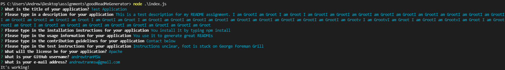

# Good README Generator

## Description
-  This application is a README generator for polished and professional looking READMEs for the working professional and developer. This code was fully written within JavaScript and is run utilizing Node.JS without any browser interaction. To run the function, the user enters `node index.js` in the Terminal and will be prompted a series of questions that will help build their README. Upon completion of the prompts, a MarkDown file will be created in the user's directory. Adjustments can also be made after the creation of the ReadMe for easier customization based on what the user needs.

## Table of Contents
- [Functionality](#functionality)

- [Screenshot of Terminal](#screenshot-of-terminal)

- [How to use](#how-to-use)

- [How to install](#how-to-install)

- [Questions](#questions)
## Functionality

## Screenshot of Terminal

## How to use
- This is used for generating a clean README.

## How to install
- NPM install or NPM i

## Questions
- Github: (https://github.com/andrewtranMSW)
- E-mail address: andrewtranmsw@gmail.com